User manual

Pointspay - PrestaShop module

**Module installation**

To install the Pointspay module, a merchant needs to go to the ***Modules > Module Manager*** page and click on the “*Upload a module*” button. After the module has been installed, it will be shown under the ***Payment*** tab.

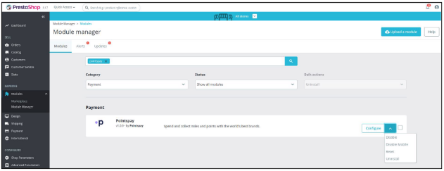

Also, from the *Module Manager* page, the module can be disabled or enabled, can be reset (that means uninstallation then installation has been done), or can be uninstalled and removed from the store. Additionally, a merchant can go to the module’s configuration page by clicking on the “*Configure*” button.

**Integration configuration page**

The configuration page can be opened from the *Module Manager* page, but also from the ***Payment > Payment Methods*** page, where the Pointspay module is listed as an Active payment.

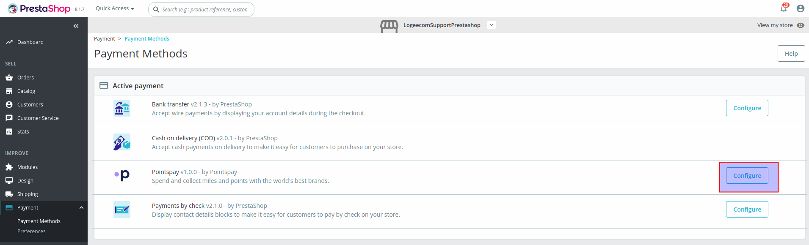

**Authorization form**

If a merchant hasn’t been authorized yet (e.g. a merchant visits the configuration page for the first time), he/she only sees the authorization section where he/she needs to select the environment and enter the API key to fetch the Pointspay payment methods and configure them.

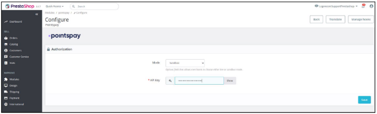

If the API key is valid and the authorization is successful, the merchant will see a message confirming successful authorization. Two additional forms will appear on the configuration page: *General settings* and *Payment flavours*.

**General settings**

The general settings form contains options common to all Pointspay payment methods.

In this form, the merchant can choose to enable or disable Debug mode, which logs every request and response to the Pointspay API if debug mode is enabled. Those logs are visible on the *Advanced Parameters > Logs* page.

The other option allows the merchant to define the order status that should be assigned to the PrestaShop order when the order is placed using a Pointspay payment method. Since PrestaShop does not have a finite order status list, it is possible to add new and edit existing order statuses in a shop administration. However, all available statuses are listed with the default status being “*Payment accepted*”.

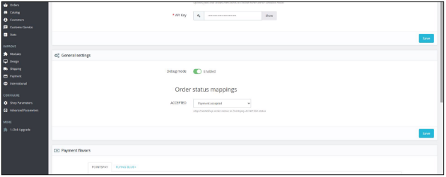

**Payment flavours**

In the payment flavours section, the retrieved available methods are displayed as tabs, where each payment flavour can be individually configured.

The merchant can enable or disable a method, select countries in which the method will be available, and set a sort order number to define the order in which the payment methods appear at checkout.

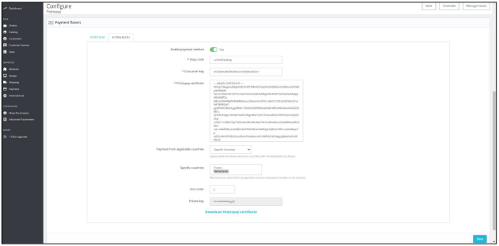

To configure the method, a merchant must enter the shop code used for payment requests, along with the consumer key and the Pointspay certificate.

Additionally, integration will generate a certificate public/private key pair after the credentials are saved and show the private key as a read-only field, with only the last four characters displayed to the user.

Finally, merchants can download the **.*cer*** certificate file to share with the Pointspay team and process payment requests from PrestaShop.

**Checkout**

Each enabled Pointspay payment flavor will be displayed as a standard payment method offered in the PrestaShop checkout during the payment step of the checkout process.

A payment method appears at checkout if it is enabled on the configuration page and if the customer's billing address country is among the countries where the flavour is available. Pointspay payment methods are displayed in the order defined by the Sort order values in the flavours configurations.

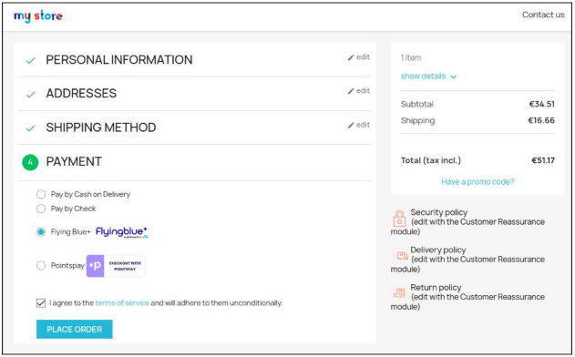

After the customer selects a Pointspay payment flavor and submits an order, the integration will redirect the customer to the Pointspay portal, where she/he can finalize or cancel the payment.

In case the payment is successful on the Pointspay portal, the customer is redirected to the *Order confirmation* page. In the *Order details* section, the payment method is a Pointspay flavour by which it was paid:

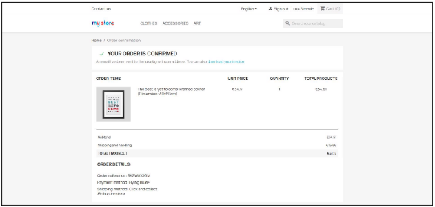
In case of a payment error or cancellation on the Pointspay portal, the customer is redirected back to the payment step of the checkout page:

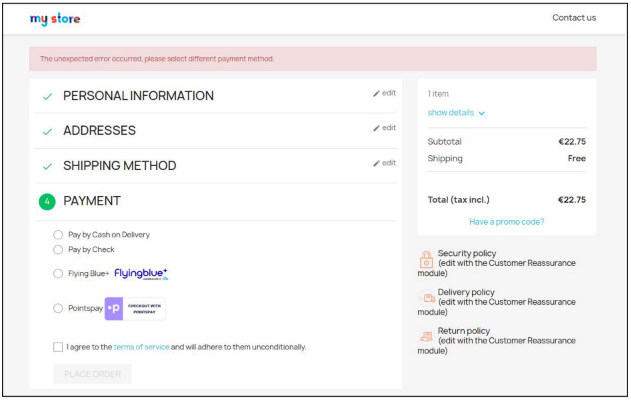

**Pointspay order reference**

In the case of successful payment, on the <https://uat-onpayment.pointspay.com/> orders overview page, there is a new transaction record with PrestaShop order details.

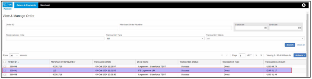

The merchant Order number of the created order reference represents the PrestaShop cart ID. A Merchant can go to the ***Orders > Shopping Carts*** page and link the cart ID with a corresponding order ID.

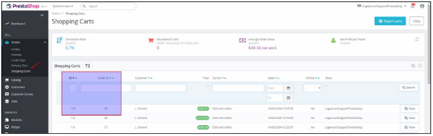

Then, the merchant goes to the *Orders > Orders* page and finds the order with the order ID he/she just saw on the *Orders > Shopping Carts* page. Order is created with a status that is defined in the order status map on the integration’s configuration page.

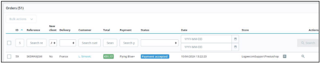

**Refund**

A merchant can refund a paid order on the order details page. There are two standard ways to create a refund or partial refund in the PrestaShop: ***Standard refund*** and ***Partial refund***.

**Standard refund**

The merchant can perform a standard refund by first enabling it on the Customer Service > Merchandise Returns page.

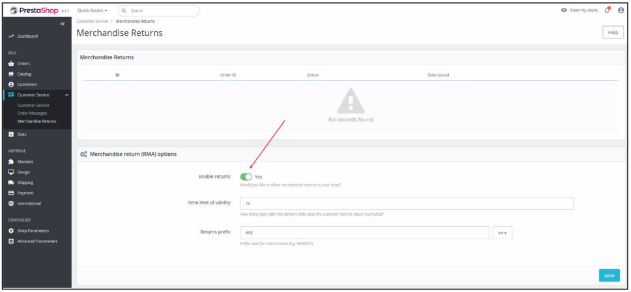

The merchant can then perform a standard refund on the order details page, by clicking on the “*Standard refund”* button.

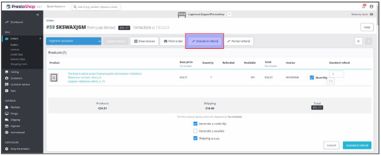

The merchant can then select a quantity of order items to refund and click on the “*Standard refund”* button at the bottom. The merchant can also tick a box to refund the shipping cost.

**Partial refund**

The merchant can partially refund a paid order by clicking on the “*Partial refund*” button under the order lines on the order details page. This opens a new section on the order details page where the merchant can refund order items by quantity or by amount.

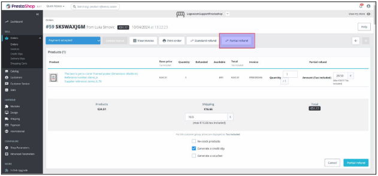

However, the merchant must always specify the quantity of order items, even when refunding them by amount. This imposes a limitation on how much amount of each order item can be refunded since PrestaShop will allow refunding the amount up to the total order item amount for the selected quantity (ex. if the merchant selects to refund 2 out of 5 quantities for an order item that costs 10 euros per piece, the maximum allowed refund value for that order item will be 20 euros). Additionally, once any amount of a specific order item is refunded, PrestaShop will not allow any additional refunds for that order item.

**Module removal**

When a module is removed from the PrestaShop, all module-related data and database tables will be removed. To remove the module go to **Modules** > **Module** Manager and search for the Pointspay module.

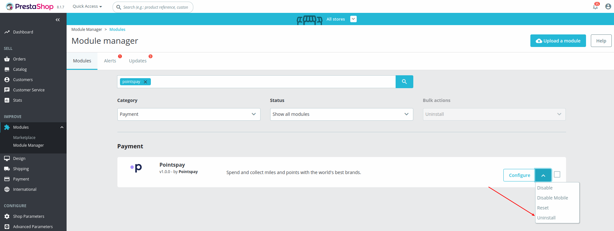

**Refund**

When the module is uninstalled and deleted, it is still possible to create a refund in PrestaShop for orders previously paid using the Pointspay payment method. However, since the Pointspay module has been removed, the corresponding refund will not be created in Pointspay, even though PrestaShop indicates that the order has been refunded.

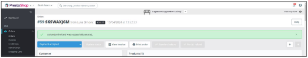

The order is then in an inconsistent state, but this is expected because the integration no longer exists at that point.
