

Integration user manual

Salesforce B2C Commerce integration

Installation and setup

Installation

Step 1: Add cartridge to cartridge path

Upload the cartridge poinstpay\_sfra into your sandbox updating the cartridge path. To do so, go to **Business Manager > Administration > Sites > Manage Sites > Your Target Site > Settings** and insert pointspay\_sfra before your cartridges record. Please also make sure to include the app\_storefront\_base cartridge which is the root SFCC cartridge required for all others to work.

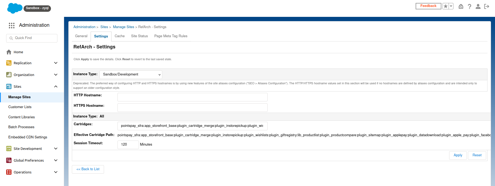

Click apply and verify that the pointspay\_sfra cartridge is displayed in the Effective Cartridge Path.

Step 2: Import metadata archive

Upload and import pointspayMetadata.zip from the cartridge metadata folder, which includes definitions for payment providers, methods and custom configurations. To do so, go to **Business Manager >Administration > Site Development > Site Import & Export.** Upload archive using Local option in the Upload Archive section. Make sure to change the name of the “RefArch” folder to the name of the site you want to upload this to. After upload choose pointspayMetadata.zip in the list and click on the Import button.

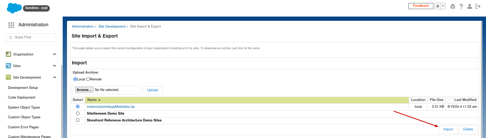

Make sure to verify the status of the import once it completes.

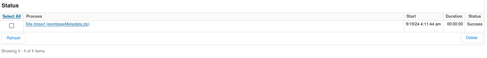

Payment flavor configuration

After successfully adding the cartridge to the cartridge path and uploading the metadata files, available Pointspay payment flavors will be shown in the list of payment methods, available at **Business Manager > Merchant Tools > Ordering > Payment Methods.**

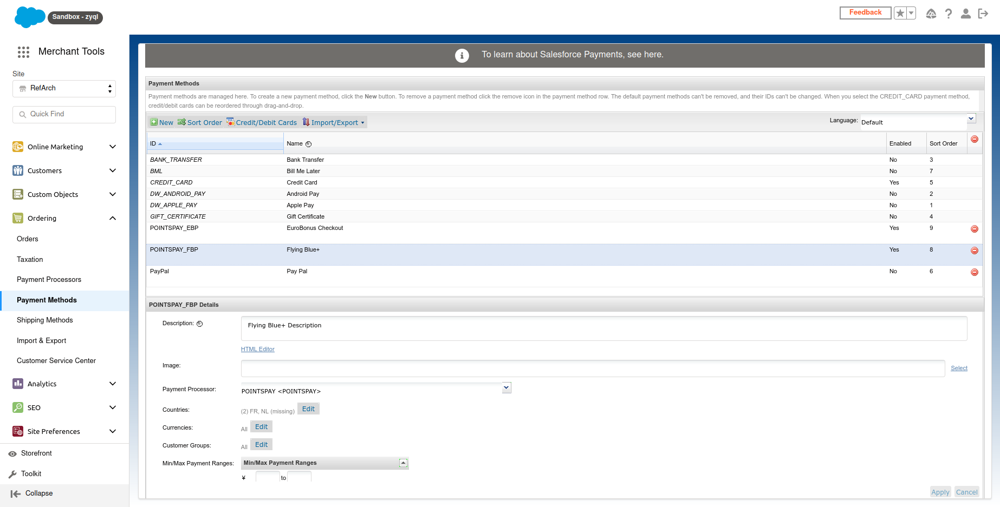From here, you can configure the native Salesforce configuration options, such as name, description, supported countries, currencies and customer groups for each of the Pointspay payment flavors, as well as define some amount conditions for which you want to display these flavors for.

In addition to that, there are also custom Pointspay configurations that are required in order to display these flavors on the Salesforce B2C storefront. These are available within the “Pointspay” section of the payment method configuration page.

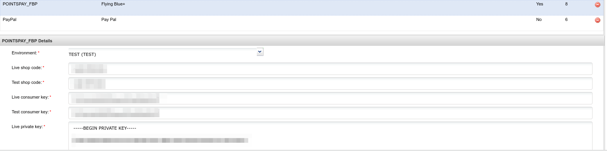

Pointspay configuration consists of the following environment-specific fields:

- **Shop code** - text field
- **Consumer key** - text field
- **Private key** - textarea field (value used for signing payment requests to the Pointspay API)
- **Pointspay public key** - textarea field (value used for verifying incoming requests from the Pointspay API)
- **Debug mode** - toggle field where merchants can select whether to switch the debug mode on or off

Displaying payment flavors on the storefront

After configuring the Pointspay payment flavors, once customers add products to their cart and enter their shipping and billing information, they will be presented with Pointspay payment flavors among available payment options in the billing section of the checkout page.

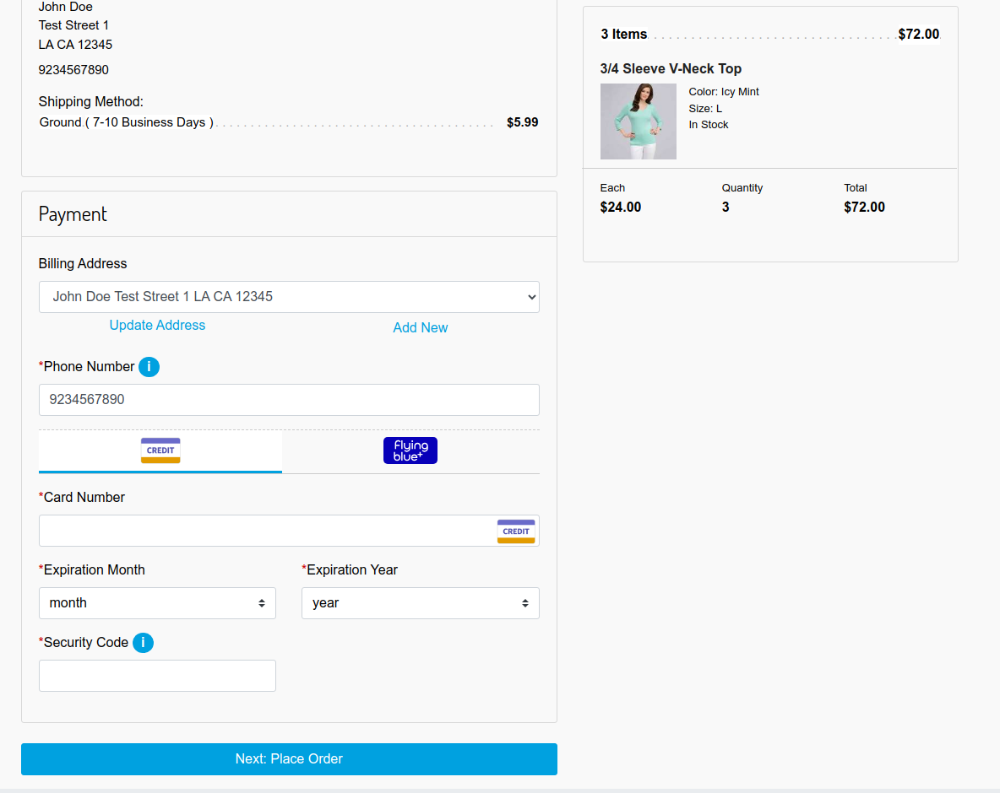

Once the customer selects a Pointspay payment flavor by clicking on its corresponding tab, he/she will be presented with its title and description from the configuration.

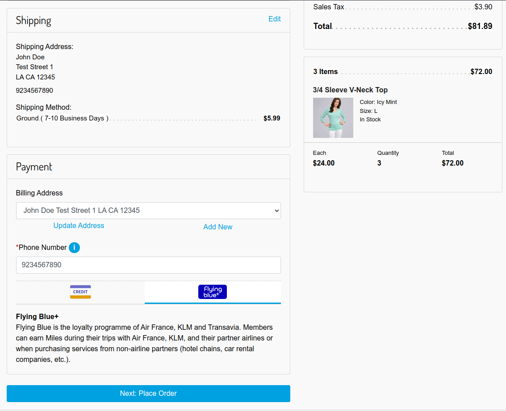

Order submission

After confirming their selection, customers reach the final step before placing their order where they can review all of the entered information and selected shipping and billing methods, and can choose to edit their cart before placing the order.

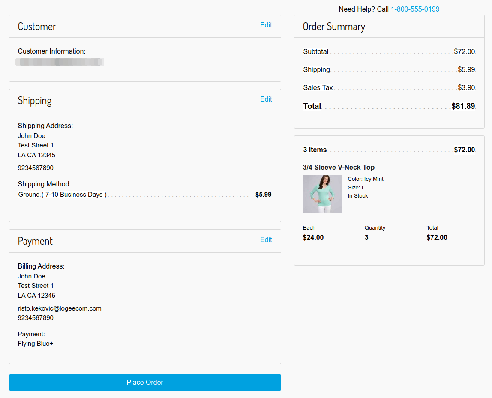

After hitting the “Place Order” button, customers are redirected to an externally hosted payment page to complete their payment.

In the case of Flying Blue+, here they can choose whether to pay for the order with a credit card or accumulated loyalty points (or a combination of those two).

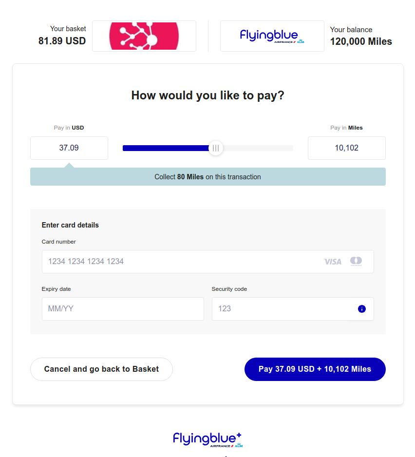

After confirming and paying for the order, customers are redirected back to the Salesforce B2C storefront and presented with the order confirmation page, where they can once again see the order summary with all the information and selected shipping and payment options.

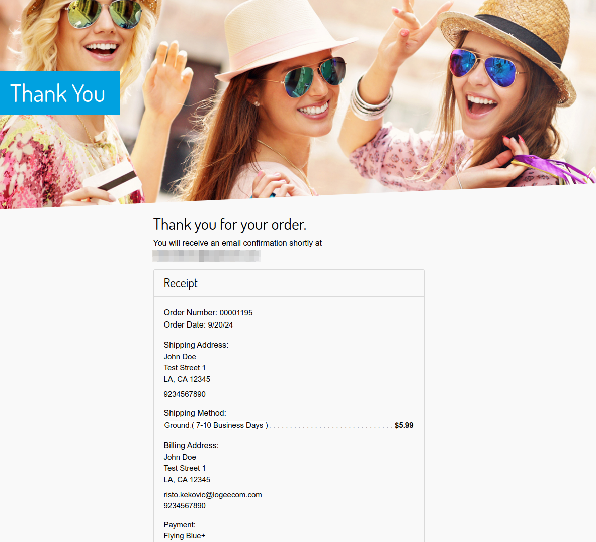

Order management

After an order paid using one of Pointspay payment flavors has been created, merchants can review it by going to **Business Manager > Merchant Tools > Ordering > Orders** and searching for it by its ID.

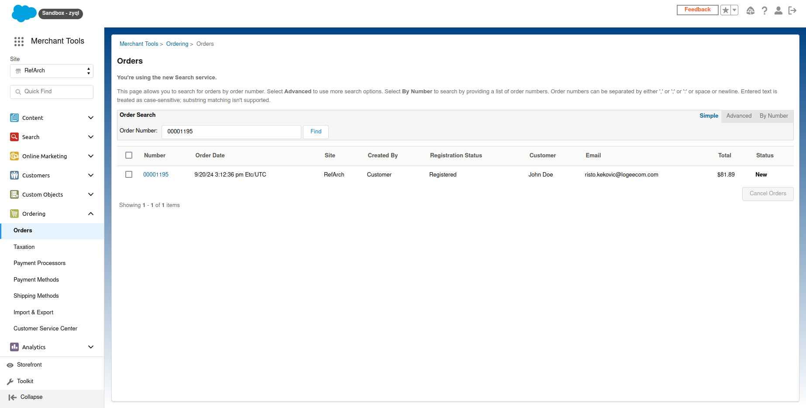

On the payment tab, they can review the current status of the payment, as well as the selected payment flavor and amount.

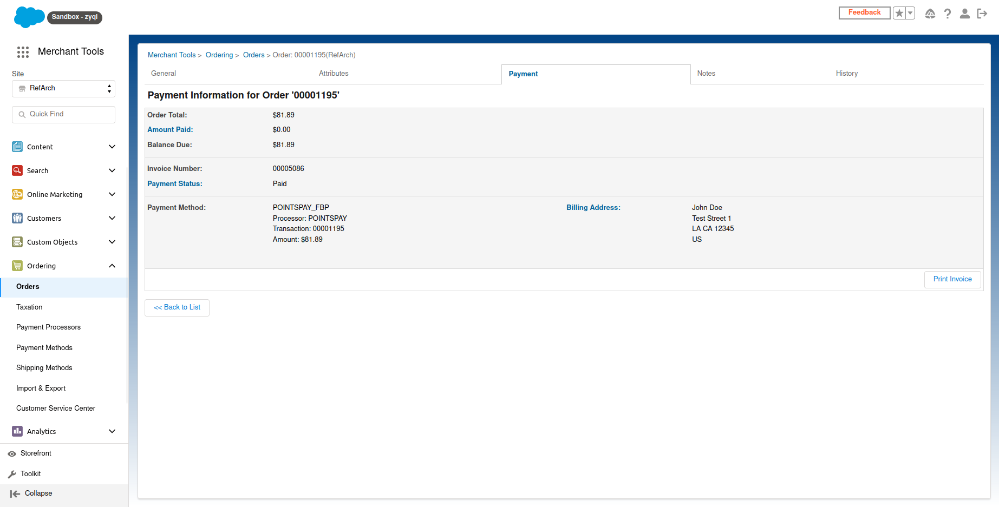

